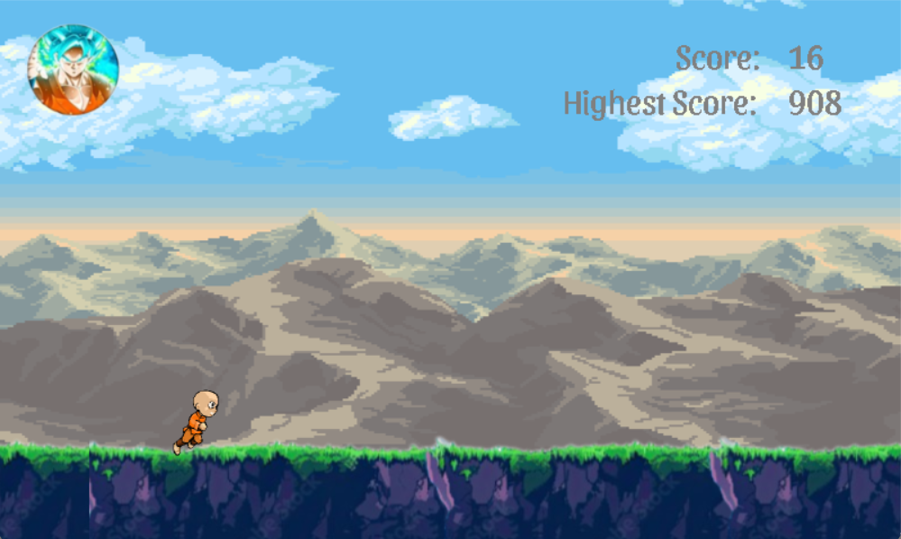

# WELCOME TO MY GAME
This is a endless runner game.
# Video Demo
[Link Youtube](https://www.youtube.com/watch?v=Rg9_63BR1gY)
# Author
Vu Manh Cuong - 23020590
# Programming Languages
C++
# Supported Software
- IDE: CodeBlocks
- SDL2
# Installation Guide
1. Install CodeBlocks.
2. Download SDL2 and related libraries: SDL_image, SDL_mixer, SDL_ttf
3. Clone this project from GitHub .
4. Open the project in VS and build it.
5. Run and enjoy the game.
# Demo
You need to control the character to overcome obstacles by pressing buttons
- Up to Jump 
- Down to Crouch
- -> to Tranform
- <- to cancel the tranform

 
